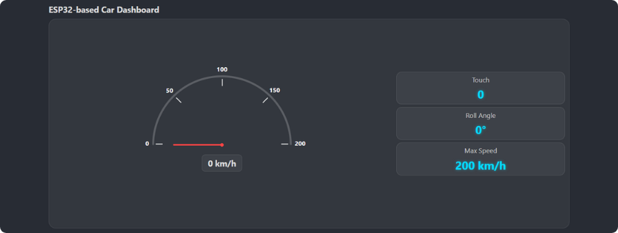
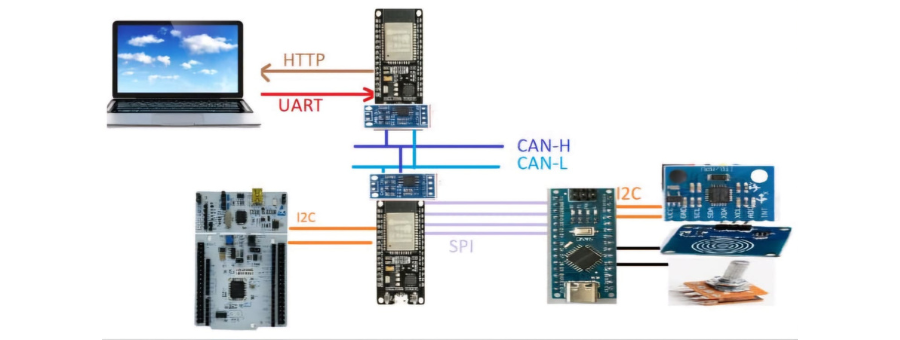

  

# Vehicle Dashboard with ADAS and AI Features

This repository documents a school project for designing a vehicle dashboard system that integrates `ADAS` (Advanced Driver Assistance System) features, real-time sensor data, and AI-based speed limitation based on detected road signs.

## Overview

The project uses multiple microcontrollers to implement a reliable communication and control system for a vehicle dashboard. It also incorporates computer vision to detect speed limits and enforce safe driving decisions in real-time.

## System Architecture

The system consists of:

- **ESP32 (Dashboard)**: Hosts the dashboard UI and communicates with the AI detection system.
- **ESP32 (Intermediate)**: Acts as a central controller between the Arduino, Dashboard ESP32, and STM32.
- **Arduino Nano**: Handles driver inputs and sensors (touch, angle, ...).
- **STM32 Nucleo-F446RE**: Final controller for motor control and safety enforcement.
- **Python Script**: Performs road sign detection and sends speed data via serial.

## Contents

- **Datasheets**: Key datasheets and reference manuals of the components used.
- **Circuit Diagram**: Overview of the system architecture, flow diagrams, and protocol mapping.
- **Main Firmware**:
  - `Arduino_Sensors_Data.ino`: Reads touch sensors, angle, and driver speed input.
  - `ESP32_intermediate.ino`: Receives data from Arduino and the ESP32 Dashboard, sends command data to the STM32.
  - `ESP32_Car_Dashboard.ino`: Hosts dashboard server, displays environment info, and receives data from the Python script.
  - `htmlPage.h`: HTML page served by the ESP32 Web Server.
  - `STM32_Motors_Control/`: STM32 code to handle final motor control decisions.
- **AI Detection**:
  - `main.py`: Python code that detects speed limits from road signs using AI.
- **Tests**: Example sketches to verify communication protocols.

## Communication Protocols Used

Each microcontroller communicates using a different protocol:

- **UART**: Between ESP32 Dashboard and Python AI script.
- **HTTP**: Used by the ESP32 Dashboard to serve the web-based UI.
- **CAN**: Between the two ESP32 microcontrollers.
- **I2C**: Between ESP32 Intermediate and STM32.
- **SPI**: Between Arduino Nano and ESP32 Intermediate.
- **I2C**: For sensor connections on Arduino (if needed).

## AI-Based Speed Limitation

The AI system uses a camera and a Python script to:

- Detect road sign images (speed limits),
- Parse and extract the speed limit,
- Send the max allowed speed to ESP32.

The ESP32 then compares the detected speed to the user’s speed input and sends the **minimum of both** to STM32 for enforcement.

## Dashboard UI

A simple, responsive dashboard is served by the ESP32. It shows:

- Detected speed limit,
- Driver input speed,
- Final allowed speed,
- Real-time sensor data (tilt/roll, touch interaction, ...),
- Speedometer with a rotating needle for visualizing actual speed dynamically.

Whether you're into embedded systems, automotive safety, or practical AI, this project bridges them all in one place.

Suggestions, feedback, and contributions are always welcome!
